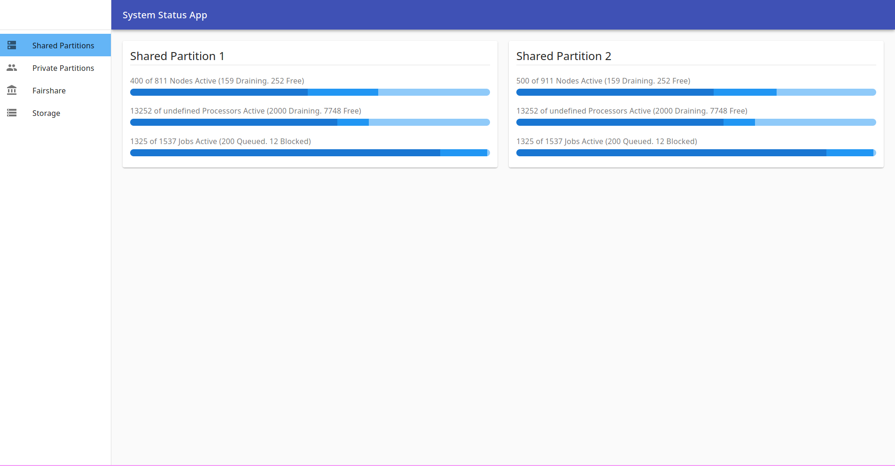
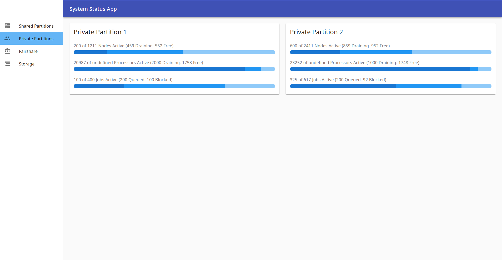
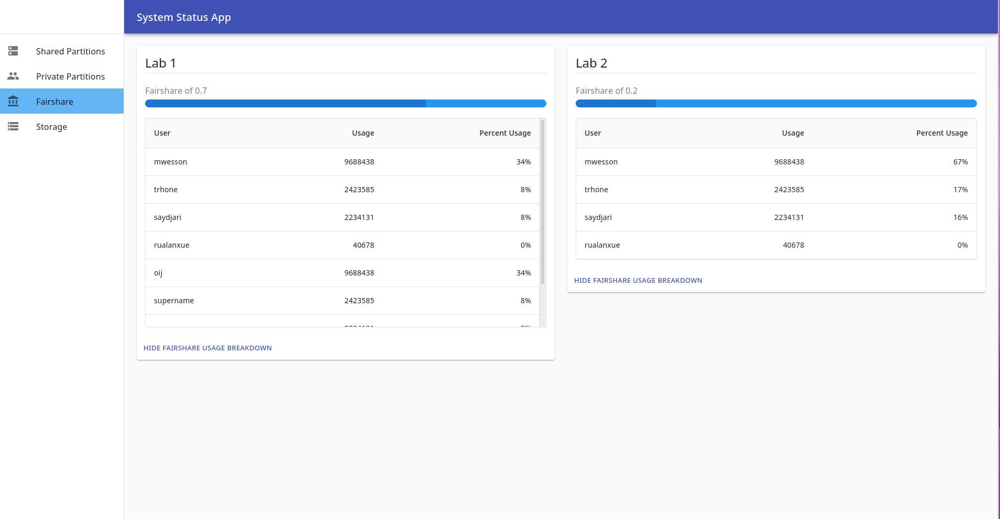
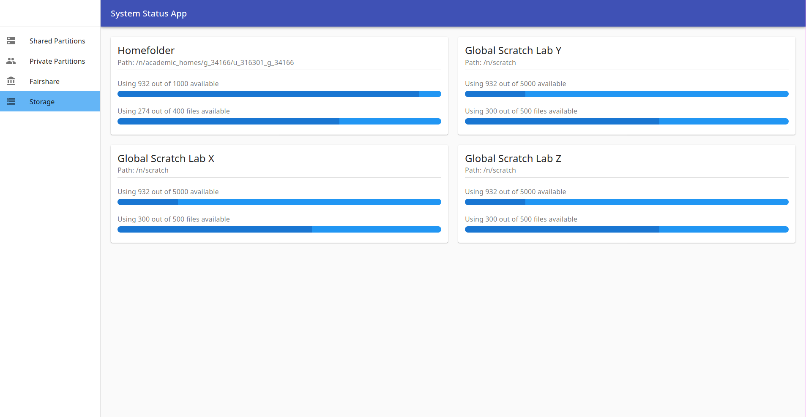

# Status App

## Stack

The frontend is developed in React with CRA and Material-UI. The backend is developed with node express. This repository is mirrored at https://github.com/Ruborcalor/hpc-status-app. Feel free to open issues there.

## Screenshots






## Data

There are four views in the status app:
- Shared Partitions
- Private Partitions
- Fairshare
- Storage

Each of these pull data from a json file, the location of which can be customized in `app.js`.

### sharedPartitionData.json:
```
[{
  "name": "Public Partition 1",
  "nodes": {
    "active": 400,
    "draining": 159,
    "free": 252
  },
  "processors": {
    "active": 13252,
    "draining": 2000,
    "free": 7748
  },
  "jobs": {
    "running": 1325,
    "queued": 200,
    "blocked": 12
  }
}, {
  "name": "Public Partition 2",
  "nodes": {
    "active": 500,
    "draining": 159,
    "free": 252
  },
  "processors": {
    "active": 13252,
    "draining": 2000,
    "free": 7748
  },
  "jobs": {
    "running": 1325,
    "queued": 200,
    "blocked": 12
  }
}]
```

### privatePartitionData.json:
```
[{
  "name": "Private Partition 1",
  "groups": ["sys", "group2"],
  "nodes": {
    "active": 200,
    "draining": 459,
    "free": 552
  },
  "processors": {
    "active": 20987,
    "draining": 2000,
    "free": 1758
  },
  "jobs": {
    "running": 100,
    "queued": 200,
    "blocked": 100
  }
}, {
  "name": "Private Partition 2",
  "groups": ["sys", "group3"],
  "nodes": {
    "active": 600,
    "draining": 859,
    "free": 952
  },
  "processors": {
    "active": 23252,
    "draining": 1000,
    "free": 1748
  },
  "jobs": {
    "running": 325,
    "queued": 200,
    "blocked": 92
  }
}]
```

### fairshareData.json:
```
[{
  "name": "Lab 1",
  "fairshare": 0.7,
  "users": ["gautierk", "anotheruser", "ckillian", "u_316301_g_34166"],
  "fairshareTableData": [{
    "user": "mwesson",
    "usage": 9688438
  }, {
    "user": "trhone",
    "usage": 2423585
  }, {
    "user": "saydjari",
    "usage": 2234131
  }, {
    "user": "rualanxue",
    "usage": 40678
  }, {
    "user": "oij",
    "usage": 9688438
  }, {
    "user": "supername",
    "usage": 2423585
  }, {
    "user": "yesname",
    "usage": 2234131
  }, {
    "user": "hiname",
    "usage": 40678
  }]
}, {
  "name": "Lab 2",
  "fairshare": 0.2,
  "users": ["gautierk", "anotheruser", "ckillian", "u_316301_g_34166"],
  "fairshareTableData": [{
    "user": "mwesson",
    "usage": 9688438
  }, {
    "user": "trhone",
    "usage": 2423585
  }, {
    "user": "saydjari",
    "usage": 2234131
  }, {
    "user": "rualanxue",
    "usage": 40678
  }]
}]
```

### homefolderStorageData.json


```
[{
    "name": "Homefolder",
    "path": "/n/academic_homes/g_34166/u_316301_g_34166",
    "users": ["u_316301_g_34166"],
    "block": {
      "limit": 1000,
      "usage": 932
    },
    "file": {
      "limit": 400,
      "usage": 274
    }
  },
  {
    "name": "Homefolder",
    "path": "/n/academic_homes/g_34166/u_316301_g_34166",
    "users": ["user_two"],
    "block": {
      "limit": 1000,
      "usage": 932
    },
    "file": {
      "limit": 400,
      "usage": 274
    }
  }
]
```

### scratchStorageData.json
```
[{
    "name": "Global Scratch Lab Y",
    "path": "/n/scratch",
    "groups": ["sys"],
    "block": {
      "limit": 5000,
      "usage": 932
    },
    "file": {
      "limit": 500,
      "usage": 300
    }
  },
  {
    "name": "Global Scratch Lab X",
    "path": "/n/scratch",
    "groups": [
      "sys"
    ],
    "block": {
      "limit": 5000,
      "usage": 932
    },
    "file": {
      "limit": 500,
      "usage": 300
    }
  }
]
```

## Development

Developed with node v10. Yarn v1.22 is used for managing node packages.

Start the frontend by running `cd client && yarn start` and start the backend by running `node app.js`. The backend runs on port 5000. The frontend runs on port 3000 and proxies api requests to the backend. Visit the site at http://localhost:3000/pun/dev/hpc_2/shared-partitions

Prepare a production build of the frontend with `cd client && yarn build`. Then you can run `node app.js` and the backend will serve the frontend. Visit the site at http://localhost:5000/pun/dev/hpc_2/shared-partitions

The app is served at a subroute based on the `basename`. See the `Variables` section of the README for more.

## Variables

The app is served on a subroute. The subroute is set with the basename variable which is present in `client/package.json`, `app.js`, and `.env`. Make sure to set these variables based on the subroute that you are using. This will change when moving to production for example. It is currently set to `/pun/dev/hpc_2` because when I added the project to the app develop section of OnDemand I choose `hpc_2` as the name of app.

## Available Scripts

In the `client` directory, you can run:

### `yarn start`

Runs the app in the development mode.<br />
Open [http://localhost:3000](http://localhost:3000) to view it in the browser.

The page will reload if you make edits.<br />
You will also see any lint errors in the console.

### `yarn build`

Builds the app for production to the `build` folder.<br />
It correctly bundles React in production mode and optimizes the build for the best performance.

The build is minified and the filenames include the hashes.<br />
Your app is ready to be deployed!

See the section about [deployment](https://facebook.github.io/create-react-app/docs/deployment) for more information.

## Learn More

You can learn more in the [Create React App documentation](https://facebook.github.io/create-react-app/docs/getting-started).

To learn React, check out the [React documentation](https://reactjs.org/).

### Code Splitting

This section has moved here: https://facebook.github.io/create-react-app/docs/code-splitting

### Analyzing the Bundle Size

This section has moved here: https://facebook.github.io/create-react-app/docs/analyzing-the-bundle-size

### Making a Progressive Web App

This section has moved here: https://facebook.github.io/create-react-app/docs/making-a-progressive-web-app

### Advanced Configuration

This section has moved here: https://facebook.github.io/create-react-app/docs/advanced-configuration

### Deployment

This section has moved here: https://facebook.github.io/create-react-app/docs/deployment

### `yarn build` fails to minify

This section has moved here: https://facebook.github.io/create-react-app/docs/troubleshooting#npm-run-build-fails-to-minify
